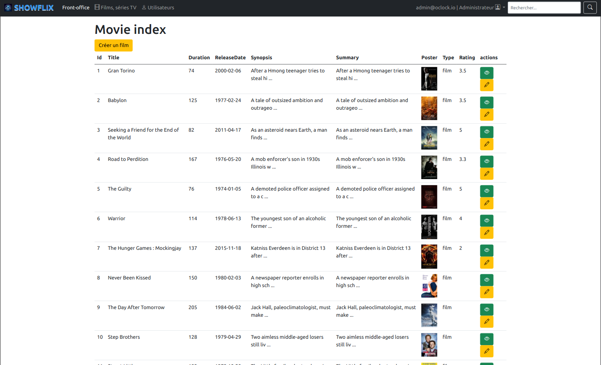

# Projet ShowFlix, 

Dans le cadre de ma découverte du framework Symfony, j'ai développé un site répertoriant des films et séries. Ce site a été nommé ShowFlix.

J'ai un maximum commenté mon code afin que mon site soit à la fois plus viable et maintenable sur la durée.

Note : Le site contient pour le moment des données fictives, il peut y avoir des incohérences, mais le but était pour moi de manipuler Symfony, le site sera plus cohérent dans l'avenir.

Voici quelques captures d'écran concernant le contenu fournis afin que vous puissiez avoir un aperçu des fonctionnalités.

## Captures d'écran du site

### 1. Page d'accueil

### 2. Page du film ou de la série

### 3. Page des favoris utilisateur

### 4. Liste des films ou des Résultats de recherche

### 5. Changement de la nav si Admin

### 6. Backoffice 

### 7. Page du backoffice (création d'un film)

---

### Objectifs

Se familiariser à Symfony via la documentation officielle.

## Les différentes étapes

1. Installation

2. Les routes -> Note : les premières ont été **la page d'accueil** et **la page du film/série**

3. Les assets -> Note : Contenant le CSS et des images 

Fin de la structure de base.
---

### On passe maintenant à l'intégration

- Création des contrôleurs
- Création des méthodes 
- Puis création des templates nécessaires (en dur)

### On continue ensuite avec la Dynamisation

1. D'abord la page d'accueil
2. Puis les liens
3. Puis la page du film/série

### Pour finir

- Mise en place d'une API via retour d'une réponse en JSON
- Mise une place d'une selection de favoris (stocker en session)
- Mise en place de deux services 
  - poster:clean -> permettant la mise à jour des posters du site
  - plot:clean -> permettant la mise à jour du synopsis et du sommaire
- Mise en place de test divers (voir le dossier test)
- Mise en place d'affichage conditionnel (par ex : le backoffice dans la navBar uniquement accessible aux Manager et 
  Admin)

### Améliorations futures

- Mise en place de la pagination
- Mise en place de la recherche par genre
- Mise en place du profil user
- Utilisation des slugs
- Traduction des synopsis via un bouton FR/EN
- Liste des genres
- Responsive à améliorer
